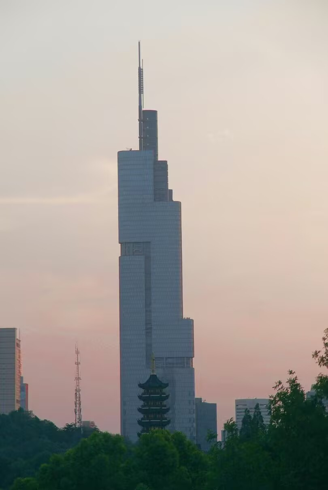

# 这是标题
这里还可以放个副标题

汇报小组：不吃荔枝等于违反天意

---

# 目录

<Toc text-sm minDepth="1" maxDepth="2" />

---

# 现象聚焦 

 

- **现象一**："芭比Q了"

- **现象二**：xxx

- **现象三**：xxx

---

# 成因剖析

 
 

- 短视频平台特性：算法推荐、碎片化传播降低认知门槛。

- 文化传播特性：简单重复、朗朗上口的梗易被模仿，而低龄人群由于认知发展尚未成熟，缺乏对内容价值与潜在风险的分辨能力，容易不加筛选地全盘接受并模仿。

- 社交需求驱动：小孩子在同伴交往中，通过玩梗、接梗融入群体，获得伙伴的认同感与归属感。

---
layout: two-cols
---

# 对比思考

## 以前

以前的公益广告聚焦品德培养、社会关怀等正向价值观。像尊老爱幼主题广告，展现孩子给老人让座、帮 父母做家务场景，引导我们践行传统美德，学会关爱 他人。这些广告在我们心中种下善良、责任的种子， 让我们明白关爱他人、遵守公德是应尽义务。

::right::

 
 
 

## 现在

如今低龄人群接触的网络梗文化，内容多样，积极与消极并存。一些励志梗能鼓舞孩子，但部分低俗、恶搞梗易对孩子价值观产生误导。比如 “绝绝子”“芭比Q了” 等流行语，虽给交流添乐趣，但过度使用会致语言 表达单一、思维浅薄。

---

# 解决策略

- **加强平台监管**

- **家长以身作则**

- **丰富课余活动**

---
layout: center 
---
# 谢谢聆听!

